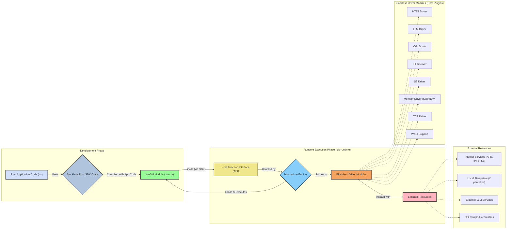
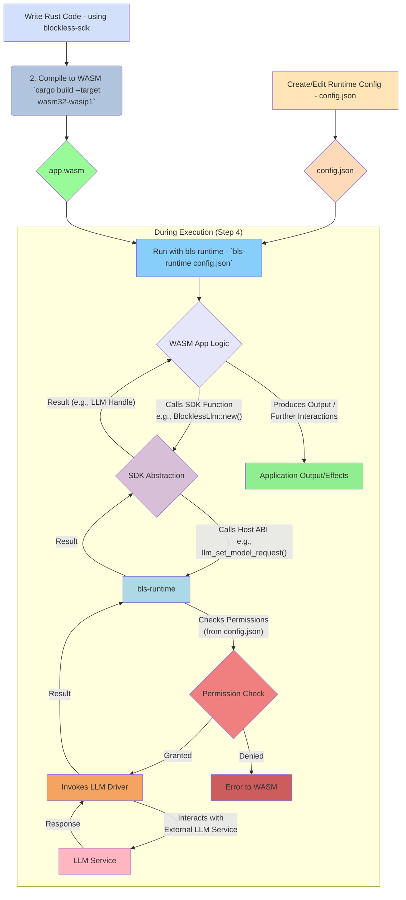

# Blockless Rust SDK

The SDK allows your Rust-based WebAssembly (WASM) modules to interact with the `bls-runtime` and `b7s-browser` WASM execution environments/runtimes.
It provides convenient wrappers around the host functions exposed by the runtime, enabling capabilities like HTTP requests, CGI script execution, LLM interactions, and more.

## Installation

Add the `blockless-sdk` to your `Cargo.toml`:

```sh
cargo add blockless-sdk
```

### Features

The SDK has an optional `serde` feature, enabled by default, which derives `Serialize` and `Deserialize` for some of its types. If you don't need this, you can disable default features:
```toml
blockless-sdk = { version = "0.1.10", default-features = false }
```

## Core Concepts

### Permissions

The `bls-runtime` operates on a permission-based model.
For your WASM module to access resources (like making an HTTP request or accessing a specific CGI script), the runtime must be configured with the appropriate permissions.
If a required permission is missing, SDK calls will likely fail.

Permissions are typically defined in the runtime's JSON configuration file:

```json
{
    "permissions": [
        "http://api.example.com/data", // Allow HTTP GET to this specific URL
        "file:///scripts/my_script.sh", // Example for CGI if it needs file access
        "cgi://my_cgi_alias" // Hypothetical permission for a specific CGI alias
    ]
}
```
Refer to the `bls-runtime` documentation for details on configuring permissions.

### Compiling Your Rust Code to WASM

To use this SDK, your Rust code needs to be compiled to the `wasm32-wasip1` target:

```bash
cargo build --target wasm32-wasip1 --release
```

This will typically produce a `.wasm` file in `target/wasm32-wasip1/release/your_crate_name.wasm`.

## Blockless Rust SDK: Architectural Overview

The Blockless Rust SDK acts as a bridge between your Rust application code and the wasm runtime. It simplifies interaction with the host functions exposed by the runtime, abstracting away the low-level details of WebAssembly System Interface (WASI) calls and custom Blockless host function ABIs.

### High-Level System Architecture

This diagram shows the main components and their relationships when building and running a WASM application with the Blockless Rust SDK on `bls-runtime`.



**Explanation:**

1. **Development Phase:**
* You write your application logic in Rust (`.rs` files).
* You include and use the `blockless-sdk` crate to access extended functionalities.
* The Rust compiler, targeting `wasm32-wasip1`, bundles your application code and the necessary parts of the SDK into a single `.wasm` module.

2. **Runtime Execution Phase:**
* The `bls-runtime` (which uses Wasmtime as its core engine) loads your compiled `.wasm` module.
* When your WASM code (through an SDK function call) needs to interact with the host (e.g., make an HTTP request):
  * It calls a function defined in the Host Function Interface (ABI). These are the `extern "C"` functions you see in the SDK's source (e.g., `http_open`, `llm_prompt_request`).
  * The `bls-runtime` intercepts this call.
  * Based on the called function (e.g., from the `blockless_http` or `blockless_llm` Wasm import module), the runtime routes the request to the corresponding **Blockless Driver Module** (plugin).
  * The Driver Module (e.g., HTTP Driver, LLM Driver) then performs the actual operation, potentially interacting with **External Resources** like the internet, local filesystem (if permitted by the runtime configuration), or specific LLM services.
  * Results are passed back through the same chain to your WASM module.

### Development and Execution Flow

This diagram shows the typical lifecycle from writing code to running your Blockless-enabled WASM application.



**Explanation:**

1. **Develop:** You write your application in Rust, leveraging the `blockless-sdk` for functionalities like HTTP, LLM, etc.
2. **Compile:** You compile your Rust project to the `wasm32-wasip1` target. This produces a `.wasm` file containing your application logic and the SDK's glue code.
3. **Configure:** You prepare a JSON configuration file for the `bls-runtime`. This file specifies:
* The path to your `.wasm` file(s).
* **Permissions:** Crucially, you must grant permissions for any host functions your WASM module will use (e.g., allowed HTTP endpoints, CGI script aliases).
* Resource limits (fuel, memory), entry points, etc.
4. **Execute:** You start the `bls-runtime` with your configuration file.
5. **Runtime Interoperation (as shown in the subgraph):**
* Your WASM application logic makes a call to an SDK function (e.g., `BlocklessLlm::new()`).
* The SDK function translates this into a specific low-level host function call (e.g., `llm_set_model_request()`).
* The `bls-runtime` intercepts this call.
* **Permission Check:** The runtime verifies if the operation is allowed based on the `config.json`. If not, an error is returned to the WASM module.
* If permitted, the runtime invokes the appropriate driver module (e.g., LLM Driver).
* The driver performs the action (e.g., initializes an LLM model, potentially downloading it or interacting with an external service).
* The result (e.g., a handle to the LLM session, or data) is passed back through the runtime and SDK to your application code.
* Your application then continues, potentially making more host calls or producing output.

## SDK Modules

The SDK provides modules to interact with different host functionalities:

### 1. HTTP Client (`BlocklessHttp`)

Make HTTP requests from your WASM module.

**Host Function Namespace:** `blockless_http`

### 2. Memory Access (Stdin & Environment Variables)

Access standard input and environment variables provided by the runtime.

**Host Function Namespace:** `blockless_memory`

#### Reading from Stdin

* `read_stdin(buf: &mut [u8]) -> std::io::Result<u32>`: Reads data from stdin into `buf`. Returns the number of bytes read.

#### Reading Environment Variables

Environment variables are passed as a single string, typically JSON formatted or newline-separated key-value pairs, as determined by the runtime.

* `read_env_vars(buf: &mut [u8]) -> std::io::Result<u32>`: Reads environment variables string into `buf`. Returns number of bytes read.

### 3. CGI (Common Gateway Interface)

Execute external scripts/programs as CGI extensions.

**Host Function Namespace:** `blockless_cgi`

Error Type: `CGIErrorKind`

### 4. Sockets (`blockless_socket`)

Primarily for creating TCP listener sockets within your WASM module, allowing it to act as a server.

**Host Function Namespace:** `blockless_socket`

* `create_tcp_bind_socket(addr: &str) -> Result<u32, SocketErrorKind>`: Creates a TCP socket, binds it to the given address (e.g., "0.0.0.0:8080"), and prepares it for listening. Returns a file descriptor.

Error Type: `SocketErrorKind`

### 5. LLM (Large Language Model) (`BlocklessLlm`)

Interact with Large Language Models supported by the runtime.

**Host Function Namespace:** `blockless_llm`

#### `Models` Enum

Specifies which LLM to use.

Common variants:
* `Llama321BInstruct(Option<String>)`
* `Llama323BInstruct(Option<String>)`
* `Mistral7BInstructV03(Option<String>)`
* `Mixtral8x7BInstructV01(Option<String>)`
* `Gemma22BInstruct(Option<String>)`
* `Gemma27BInstruct(Option<String>)`
* `Gemma29BInstruct(Option<String>)`
* `Custom(String)`: For models identified by a string not covered by specific enum variants. The string inside `Option<String>` usually refers to a quantization format like "Q6_K" or "q4f16_1".

#### `LlmOptions`

Configuration options for LLM interactions.

Fields/Methods:
* `system_message: Option<String>`: A system prompt to guide the LLM's behavior.
* `tools_sse_urls: Option<Vec<String>>`: A list of URLs for Model Control Protocol (MCP) tool servers (SSE endpoints).
* `temperature: Option<f32>`: Sampling temperature.
* `top_p: Option<f32>`: Nucleus sampling probability.
* `.with_system_message(String) -> Self`: Builder method.
* `.with_tools_sse_urls(Vec<String>) -> Self`: Builder method.

Error Type: `LlmErrorKind` (covers model issues, UTF-8 errors, MCP errors, etc.)

## Error Handling

Each module in the SDK has its own `ErrorKind` enum (e.g., `HttpErrorKind`, `LlmErrorKind`). These enums provide specific error details for operations within that module. Always check the `Result` returned by SDK functions.

## Examples

You can find more complete, runnable examples in the [`examples`](https://github.com/blocklessnetwork/sdk-rust/tree/main/examples) directory of the SDK repository.
